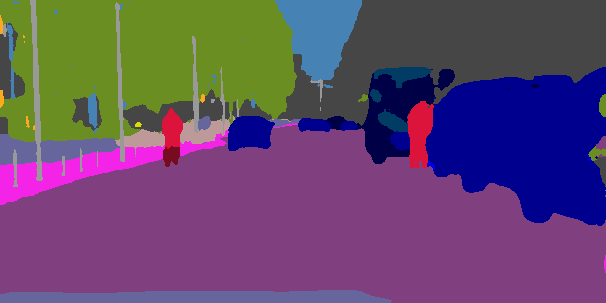

# Phase Consistent Ecological Domain Adaptation


## A message from the authors

Hey guys! Welcome to this repository of our paper 'Phase Consistent Ecological Domain Adaptation', which is accepted by CVPR 2020. First things first, here's a link to [our paper](https://arxiv.org/abs/2004.04923). Make sure to read it and you will like it. Currently we are organizing the code and will make it public available soon. Before we get our code ready, we'll first share our pretrained models that can reproduce the results presented in the paper. Check this out:

Our best result on<br/>
GTA5 ==> Cityscapes: [DeeplabV2+ResNet101: 50.5](https://drive.google.com/file/d/1ZOlQxiGQE87Dsf4i6Jw1p-zyQs5nXvfr/view?usp=sharing); [VGG16: 44.6](https://drive.google.com/file/d/1CrggRM42NwRqh2AoIVR1D2SW6Dz1NEOh/view?usp=sharing)<br/>
Synthia ==> Cityscapes: [DeeplabV2+ResNet101: 53.6 (13 classes)](https://drive.google.com/file/d/1ned8H7mibvzbSS_Xb_uMtIQCL8YH-1V2/view?usp=sharing); [VGG16: 41.1 (16 classes)](https://drive.google.com/file/d/1iwWtTzoMZ3hUkqHZw0lTeEpx9twqs7p9/view?usp=sharing)

All above pre-trained models are compatible with the [AdaptSegNet](https://github.com/wasidennis/AdaptSegNet) and [BDL](https://github.com/liyunsheng13/BDL) repositories. Shout out to these authors!

## Edit 1

Hi all! I just uploaded the CPN we used in the paper. Check the [UNet_CPN.py](./UNet_CPN.py) for details. 

I also uploaded the pre-trained model on GTA5 ==> Cityscapes using DRN-26: [DRN-26: 42.6](https://drive.google.com/file/d/1JuW4oE_T3V9H8nr4LN1DN-aVAfbpykKN/view?usp=sharing). I have tons of models stored in my laptop so hopefully I uploaded the right model. The model should be compatible with [CyCADA](https://github.com/jhoffman/cycada_release). 

[CPN_cycada](https://drive.google.com/file/d/1DkR88hS9bdHN5130hTYqfic49tobi_PS/view?usp=sharing) is the CPN we used to train this model. The parameters are compatible with [UNet_CPN.py](./UNet_CPN.py). [train_cpn_cycada.py](./train_cpn_cycada.py) is the script we used to train this CPN. You may directly put it in the folder of CyCADA and run. I trained my CPN on a laptop, which only allows very small batch size. If you have a stronger GPU, you may tune the batch size and learning rate accordingly for the best outcome. Anyway, you can always use our pre-trained CPN to save your valuable time. This CPN cleans up irregular blobs in the segmentation map pretty well.

Before:

After:

## A demo training script using CPN

See [CyCADA_train](./CyCADA_train) folder.

## Style transfer with phase consistency

Please go to the folder named "PCEDA_Phase" and execute the following command for training the image transformation.
```
python3 train.py --dataroot='./datasets/data_semseg' --gpu_ids='0' --model='cycle_gan' --display_freq=100 --display_ncols=2 --save_latest_freq=2000 --save_epoch_freq=1 --save_by_iter --niter=5 --niter_decay=15 --batch_size=1 --soft_phase=True --norm='instance' --normGNET='instance' --netG='resnet_9blocks' --display_port=18099 --name='gta2city' --lambda_A=10.0 --lambda_B=10.0 --lambda_identity=5.0 --lambda_P=50000.0 --lr=1e-5 --lrG=5e-5
```
Note: 1) currently there are only 20 example images in the folders "trainA" and "trainB" from GTA5 and CityScapes respectively. Please put the complete dataset in each folder for a reasonable experiment. 2) please check the function named "get_phase_loss" in the file "models/cycle_gan_model.py" for the implemention of the phase constraint; the phase discrepancy is currently weighted by the scalar field of the magnitude for faster convergence.

### Exporting transformed images

First comment out Line 41 in the dataloader "PCEDA_Phase/data/unaligned_dataset.py" to disable cropping and then execute the following command:
```
python3 export_images.py --dataroot='./datasets/data_semseg' --phase='train' --soft_phase=True --model='cycle_gan' --netG='resnet_9blocks' --norm='instance' --normGNET='instance' --name='gta2city' --load_iter=10000 --num_test=20 --results_dir='./results/gta2city'
```
